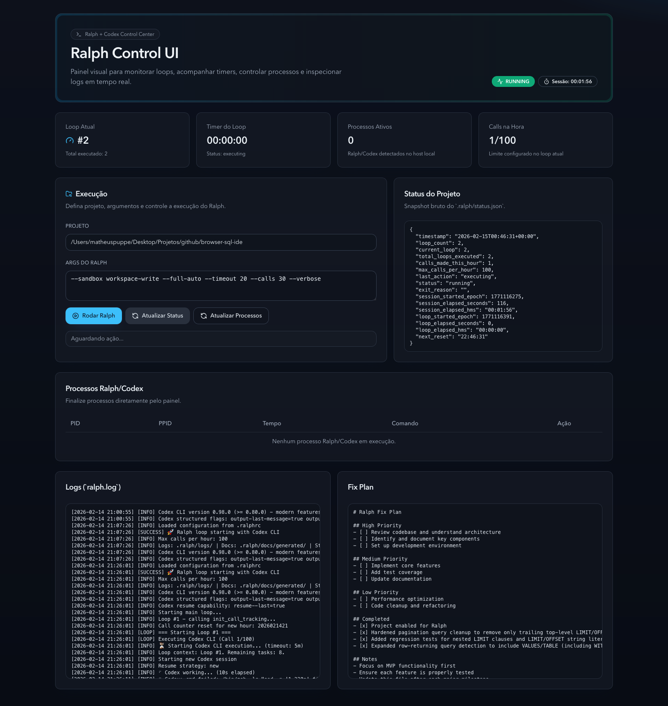

# Ralph Control UI

React UI to monitor Ralph/Codex processes and start/stop runs directly from the interface.

## Features

- View active processes (`ralph_loop.sh`, `ralph --`, `codex exec`)
- Run Ralph in a target project with custom arguments
- Stop a process by PID
- Inspect `status.json`, `ralph.log`, and `fix_plan.md`

## Screenshot



## Usage

```bash
npm install
npm run dev
```

- Frontend: http://localhost:5173
- API: http://localhost:3001

## Notes

- By default, the backend uses:
  - script: `/Users/matheuspuppe/Desktop/Projetos/github/ralph-codex/ralph_loop.sh`
- To work properly, the target project must have `.ralph/` enabled.
